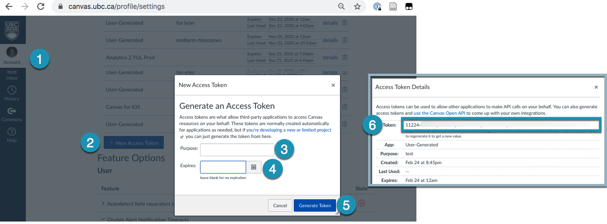
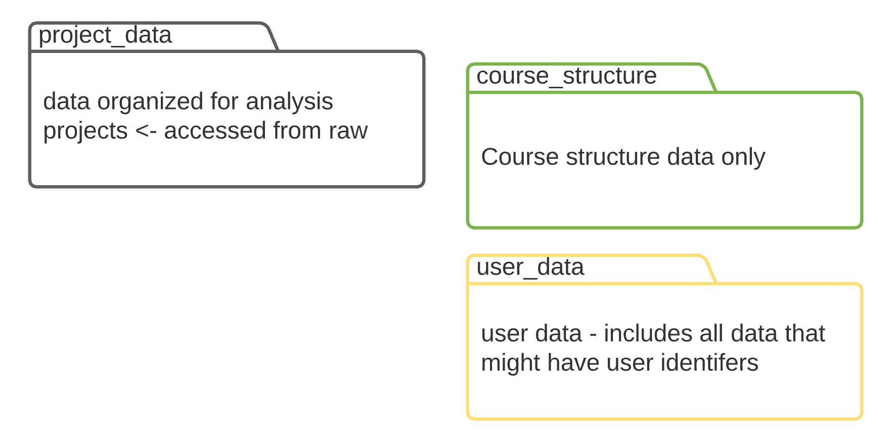
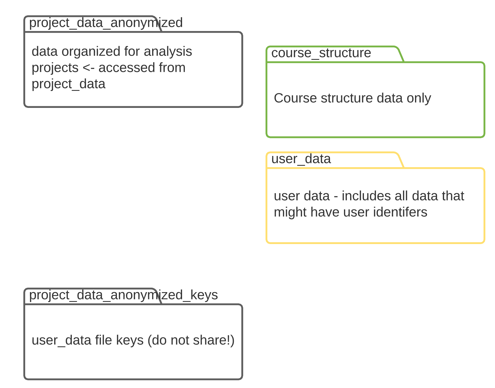

# Canvas Course Details

> THIS IS A WIP PROJECT
> Questions? Talk to Alison :) 

Given a course id, extracts details of course including:

## Goals
3 levels of "data" 
1. Skeleton 
2. Course Details
3. Student Details
4. Student Interaction -> outside of scope of API data (aspirational)

## 🗂 Data Structures
### Skeleton
- assignments
- quizzes
- pages
- enrollments
- tabs (navigation)
- *external tools* 
- features
- discussion_topics
- modules
- module_items
- files

### Course Details
- page_links *TODO*
### Student Details
- student_discussion_responses *TODO*
- student_submissions

### Student Interaction
- A user can download student interaction data in Canvas from New Analytics. Given that the data is downloaded consistently (Canvas only has 27 days in New Analytics), and stored in `data/{COURSE_ID}/new_analytics_input` when prompted, the goal is to be able to combine student interaction with other course and student data for a "full picture" of the course and its activity. 
- The assumption is you are using the direct download of New Analytics data. 


## 🚀 Use
### Computer Setup

1. We use conda, and suggest miniconda for your projects: [Install Miniconda](https://docs.conda.io/en/latest/miniconda.html) -> whichever the latest 3.x version is, use the 'pkg' version if you are unfamiliar with bash
2. We also like VSCode: [Install VSCode](https://code.visualstudio.com), and the [Python Extension](https://code.visualstudio.com/docs/python/python-tutorial#_prerequisites)
3. You also need to have Git installed. We like [GitHub Desktop](https://desktop.github.com/) if you aren't familiar with terminal

### Project Setup
1. Clone this project
2. Create the environment `canvas-get-course-details` (in terminal) 
> `$ conda env create -f environment.yml`
3. In this project folder (course-details), create a .env file with the following, save in course-details folder
```
COURSE_ID = your_course_id
API_URL = 'https://ubc.instructure.com'
API_TOKEN = 'your_token'
```
> ⚠️ Your token should be kept private and secure. We recommend setting expiry on your tokens, and deleting from Canvas once no longer needed. 

Creating a .env file in VSCode is easy. in the File Explorer right click, add a new file. The file is called .env, and then you can edit it as needed in the editor window.


### Every Time

#### 1. Get the most recent version
 Go to GitHub Desktop and make sure you pull the latest version of the project.

<br>
#### 2. Open VS Code, and open the course-details folder

<br>
#### 3. Confirm you have your .env file setup, with the right `COURSE_ID` and an active `API_TOKEN`
   
   

   Reminder - creating a token:
   


#### 4. Make sure your terminal in VSCode is in the right directory
In the terminal in VS Code:
   - Make sure you are in the right directory 
   - if you opened the folder in vscode and see the project files in the explorer, then you are in the right directory 
   - if you are unsure, check with the command:
      > `$ pwd`

   - if you are not in the right directory, you can use `cd` in terminal to navigate, for example if the project is in Documents/GitHub/course-details
      > `$ cd "Documents/GitHub/course-details"` 

#### 5. Activate the environment
   - Activate the environment by entering these in order (this should have been created in project setup)
      1. > `$ conda deactivate`
      2. > `$ conda activate canvas-get-course-details`
 
#### 6. Run the scripts! (In terminal:)
> *The scripts will require user input - indicated in Blue. You will get confirmations of success in Green. If anything goes terribly wrong you will see Red output in terminal.*

You have two options: a) run all of the scripts at once, or b) follow step by step and run the scripts you need. If you don't need anonymized data, then I suggest following "run the scripts one at a time" and following steps a-c. 
#### 6.1 If you want to *run all of the scripts* which will:
- extract canvas data 
- ask you to add new analytics data to a specific folder 
- create a new project_data folder and structure
- create anonymized versions of data 


Then you just need to run one command: 
> `$ python src/project_and_anonymize.py` 

Note: this will replace any existing data if you have extracted data before. There will also be a number of inputs in terminal to enter. 

**If you've sucessfully run all of the scripts, then you're done!**
#### 6.2 If you want to *run the scripts one at a time* then follow steps a-d below:

<br>
   a) The first script gets the data from Canvas and creates your first set of folders in **course-details/data**. 
   > `$ python src/get_course_data.py` 

   If all goes well, you should see Hello <your_name_here>! and a new folder in the output with the given course_id and the data. 

   
<br>

   b) Once run successfully, you should have a folder data/COURSE_ID/raw/new_analytics_input. 
   > Add any new analytics files you have downloaded to this folder.

   We assume you have used the direct download of the New Analytics data (and not filtered data which has different file patterns)
<br>

   c) Once run successfully and your new analytics files added, run the next script which will reorganize your files into project_data (this is needed to be anonymized next)
   > `$ python src/create_project_structure.py`

   You will now see a project_data folder with course_structure and user_data files organized. All user_data files are those with any user identifiers included. 

   
<br>
   d) Now, if you need to anonymize your data, run the last script. This will copy all course_structure data, and make anonymized versions of user_data. It will also create a folder with data called project_data_anonymized_keys for if you need to pull all of the anonymized data back together. 
   > `$ python src/anonymize.py`

   


## 🌟 Acknowledgements & Contributions
This project relies heavily on the [CanvasAPI](https://github.com/ucfopen/canvasapi) python library from The University of Central Florida's open source software projects - [UCF Open](https://ucfopen.github.io/).

### Contributers

[**Sauder Learning Services**](https://www.sauder.ubc.ca/about-ubc-sauder/learning-services/people)
- [Marko Prodanovic](https://github.com/markoprodanovic), Data Analyst & Media Specialist
- [Alison Myers](https://github.com/alisonmyers), Research Analyst